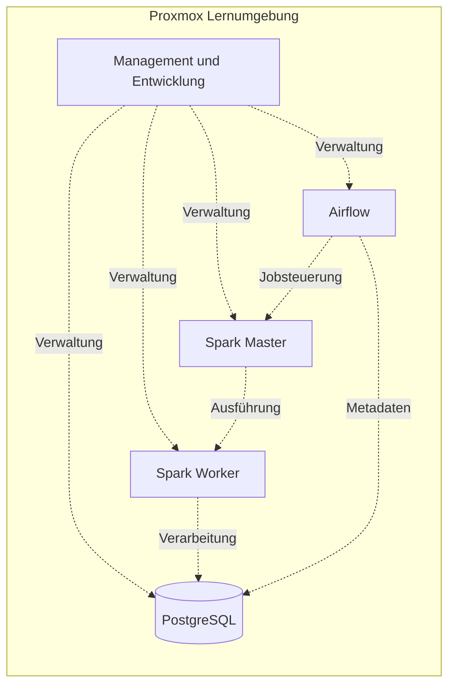

# Data Engineering Homelab

Dokumentation meiner Proxmox-Lernumgebung mit Ubuntu, Apache Airflow, Apache Spark und PostgreSQL. Ziel ist ein nachvollziehbarer Wiederaufbau in anderen Umgebungen ohne Veröffentlichung privater Netzwerk- oder Zugangsdaten.

## Dokumentation

- [Architektur und Bestand](docs/architecture.md)
- [Wiederaufbau und Abnahme](docs/rebuild.md)
- [Sichere Veröffentlichung](docs/publication.md)
- [Private Inventarvorlage](config/environment.example.yaml)

## Stand

Dokumentiert sind fünf VMs und ihre Ausstattung. Das bisherige README nennt ein PostgreSQL-Setup mit pgAdmin-Zugriff. Eine Prüfung der laufenden Umgebung wurde nicht durchgeführt. Airflow- und Spark-Konfiguration sowie die End-to-End-Pipeline sind noch zu vervollständigen. Die Anleitung ist ein Wiederaufbauplan, noch kein getestetes automatisiertes Deployment.

Die Dienstverbindungen zeigen das Zielbild; ihre Funktion ist nicht verifiziert. Azure Blob Storage ist eine mögliche Erweiterung aus der Zeichnung, kein bestätigter Bestandteil der laufenden Pipeline. Geplant bleiben außerdem Wetterdaten-ETL und Monitoring.

Öffentliche Beispiele verwenden ausschließlich Rollen und Platzhalter. Originaldokumente und Screenshots werden nicht übernommen.
